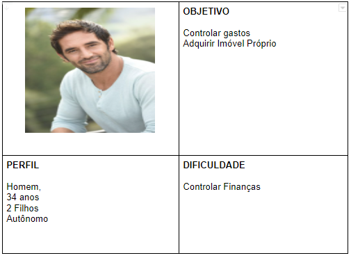
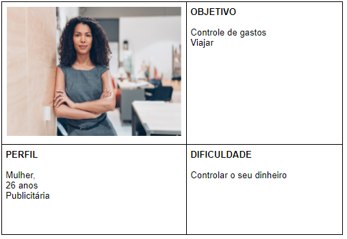
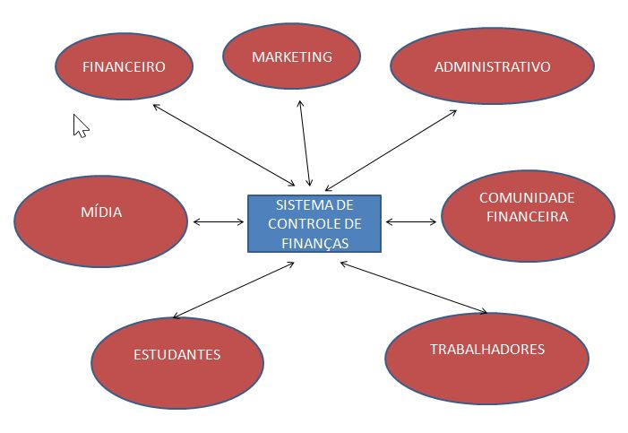

# Introdução

Texto descritivo com a visão geral do projeto abordado. Inclui o contexto, o problema, os objetivos, a justificativa e o público-alvo do projeto.

## Problema
Nesse momento você deve apresentar o problema que a sua aplicação deve  resolver. No entanto, não é a hora de comentar sobre a aplicação.

Descreva também o contexto em que essa aplicação será usada, se  houver: empresa, tecnologias, etc. Novamente, descreva apenas o que de  fato existir, pois ainda não é a hora de apresentar requisitos  detalhados ou projetos.

Nesse momento, o grupo pode optar por fazer uso  de ferramentas como Design Thinking, que permite um olhar de ponta a ponta para o problema.

> **Links Úteis**:
> - [Objetivos, Problema de pesquisa e Justificativa](https://medium.com/@versioparole/objetivos-problema-de-pesquisa-e-justificativa-c98c8233b9c3)
> - [Matriz Certezas, Suposições e Dúvidas](https://medium.com/educa%C3%A7%C3%A3o-fora-da-caixa/matriz-certezas-suposi%C3%A7%C3%B5es-e-d%C3%BAvidas-fa2263633655)
> - [Brainstorming](https://www.euax.com.br/2018/09/brainstorming/)

## Objetivos

O projeto Controle de Finanças possui como objetivo geral a capacidade de auxiliar o controle de finanças pessoal do usuário.

Além disso, são objetivos específicos do projeto:
- Exibir de forma interativa valores de entrada e saída financeira;
- Registrar a data de contas a pagar;
- Exibir calendário com as contas a pagar registradas;
- Alertar o úsuario sobre contas pendentes próximo ao vencimento.

## Justificativa

Descreva a importância ou a motivação para trabalhar com esta aplicação que você escolheu. Indique as razões pelas quais você escolheu seus objetivos específicos ou as razões para aprofundar em certos aspectos do software.

O grupo de trabalho pode fazer uso de questionários, entrevistas e dados estatísticos, que podem ser apresentados, com o objetivo de esclarecer detalhes do problema que será abordado pelo grupo.

> **Links Úteis**:
> - [Como montar a justificativa](https://guiadamonografia.com.br/como-montar-justificativa-do-tcc/)

## Público-Alvo

O Público-alvo se destina aos seguintes perfis:

<ul>
    <li><b>Pessoa física</b>, sem gênero em específico, de idade predominante entre 18 a 60 anos, localizada em qualquer região e saiba o idioma português, que possua dificuldade em controlar as suas despesas e receitas, ou gostaria de realizar o controle de seus gastos e recebimentos.</li> 
    <li><b>Pessoa jurídica</b>, de qualquer porte e segmento, no qual será utilizado por funcionários da empresa, predominante dos setores financeiro, contábil e gerencial, com o objetivo de realizar o controle de contas a pagar e receber.
    </li>
</ul>

Diagrama de Personas

 

Mapa de Stakeholders

